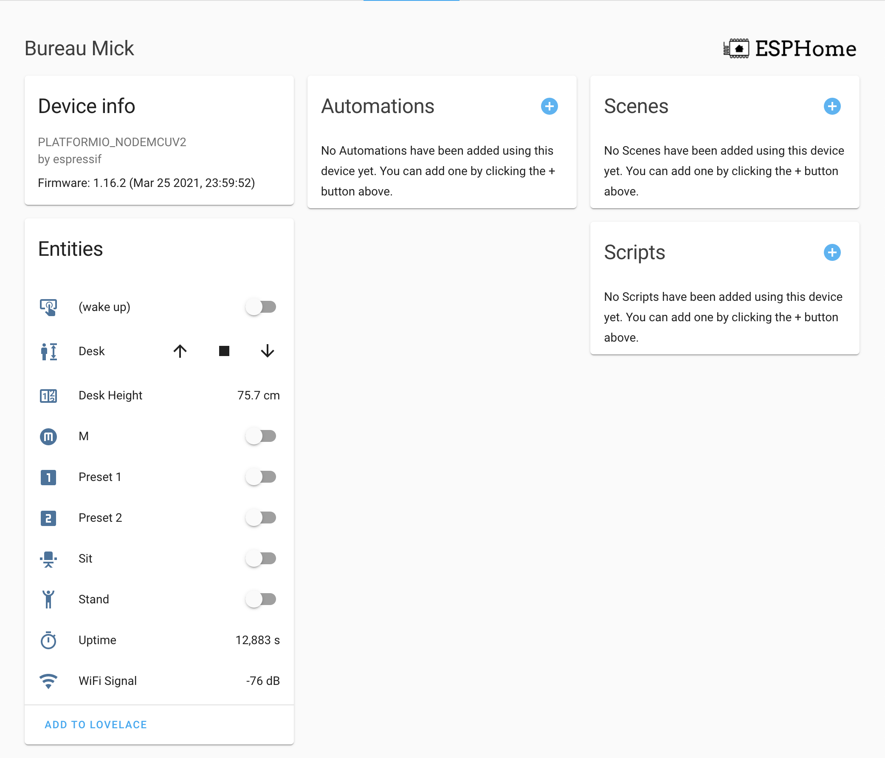

# ESPHome

>ESPHome is a system to control your ESP8266/ESP32 by simple yet powerful configuration files and control them remotely through Home Automation systems.

## [HS13A-1](https://www.loctekmotion.com/shop/control-panel/hs13a-1/)

| ESP8266 | Loctek Motion (HS13A-1) | Loctek Motion Cable Color (HS13A-1)|
| ------- | ----------------------- | ---------------------------------- |
| GND     | GND                     | Green                              |
| D6      | RX                      | Purple                             |
| D5      | TX                      | Red                                |
| D2      | PIN 20                  | White                              |

## [HS01B-1](https://www.loctekmotion.com/shop/control-panel/hs05a-1/)

| ESP8266 | Loctek Motion (HS01B-1) | Loctek Motion Cable Color (HS01B-1)|
| ------- | ----------------------- | ---------------------------------- |
| GND     | GND                     | Blue                               |
| D6      | RX                      | Green                              |
| D5      | TX                      | Black                              |
| D2      | PIN 20                  | Red                                |

## [HS01B-1] with ESP32 as passthrough and keypad support

| ESP32   | Loctek Controller (E5)      | Loctek Motion Cable Color (HS01B-1)|
| ------- | -----------------------     | ---------------------------------- |
| GND     | GND                         | Blue                               |
| GPIO16  | RX                          | Green                              |
| GPIO17  | TX                          | Black                              |
| GPIO23  | PIN 20                      | Red                                |

| ESP32   | Loctek keypad (HS01B-1) |Loctek Motion Cable Color (HS01B-1)    |
| ------- | ----------------------- | ----------------------------------    |
|         | GND                     | Blue  (Bridged to GND from controller)|
|         | RX                      | Green (Bridged to RX from controller) |
| GPIO3   | TX                      | Black                                 |
| GPIO22  | PIN 20                  | Red                                   |

Note: The rest of the cables can be passed through directly to the controller from the keypad. RX from controller is split between the Keypad and ESP directly

See [README](../../README.md#control-panels) for more details. If your board supports a 5V input, you could use the 5V provided by the control box to power your controller as well:

| ESP8266 | Loctek Motion (HS13A-1) | Loctek Motion (HS01B-1) |
| ------- | ----------------------- | ----------------------- |
| GND     | GND                     | GND                     |
| D6      | RX                      | RX                      |
| D5      | TX                      | TX                      |
| D2      | PIN 20                  | PIN 20                  |
| VIN     | +5V (VDD)               | +5V (VDD)               |

## Installation

Please refer to the [ESPHome documentation](https://esphome.io/guides/getting_started_command_line.html).

You can use `flexispot_ek5.yaml` *(HS13A-1)* or `flexispot_e5b.yaml` *(HS01B-1)* as a boilerplate for your own implementation. This implementation has been created for the ESP8266 nodemcu, but can easily be adopted for other platforms and boards.

## Features

- Up to 4 presets as switch entities
- Up / Down controls via cover entity
- Current height via sensor entity
- M button via switch entity
- Wake up button via switch entity (currently just used for testing, doesn't seem functional yet)
- Support for ESP32 (E5b only)
- Support for keypad (E5b only)

## Screenshots

